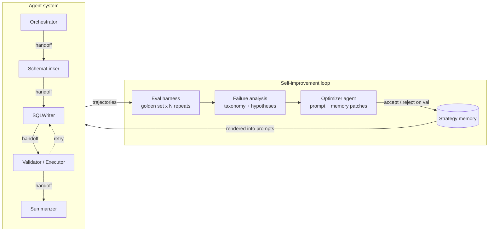

# ouroboros-sql

**A multi-agent Text-to-SQL system with a closed self-improvement loop: trajectory-level evaluation, structured failure analysis, and a gated optimizer that revises agent prompts and strategy memory.**

Built on the [OpenAI Agents SDK](https://openai.github.io/openai-agents-python/) (agents, function tools, handoffs, guardrails, sessions). The system answers analytics questions over SQLite databases through a pipeline of specialized agents. An evaluation harness measures full trajectories with repeated runs; a failure-analysis agent converts eval results into structured hypotheses; an optimizer agent proposes bounded revisions to agent prompts and a persistent strategy memory; a pre-registered acceptance gate on a validation split decides whether each revision is kept or rolled back.

## Summary of results

| System state | Execution accuracy (val, A_mean) | Evidence |
|---|---|---|
| Baseline pipeline | 48.8 [37.5, 60.0] | run `baseline-val-v0` |
| + human-written strategy memory | 53.8 [42.9, 64.6] | paired +5.0, 95% CI [+0.4, +10.0] |
| + one accepted optimizer revision | 55.4 | gate-accepted (+1.7); 5 of 6 proposals rejected |

On the held-out split (evaluated once, both arms pre-declared): 39.2 → 42.5, paired +3.3 with 95% CI [−1.7, +8.8]. The held-out improvement is directionally consistent with validation but not statistically significant at this sample size, and is reported accordingly.


All reported numbers are regenerable by a single command and backed by committed run artifacts in [`docs/results/`](docs/results/) and [`iterations/`](iterations/).

## Design rationale

The design follows three results from ICLR 2026:

1. **Evaluate trajectories, with repeated runs.** ["LLMs Get Lost in Multi-Turn Conversation"](https://arxiv.org/abs/2505.06120) (Best Paper) reports that leading LLMs lose approximately 39% performance in multi-turn settings, and that roughly 80% of the drop is attributable to unreliability (variance across runs) rather than aptitude. This harness therefore runs every golden example N times and reports an aptitude/unreliability decomposition (A_mean / A90 / U90) alongside tool-usage and handoff metrics, rather than a single accuracy score.
2. **Memory as a first-class, evolvable artifact.** [ALMA](https://arxiv.org/abs/2602.07755) meta-learns memory designs as executable code; [MemAgent](https://arxiv.org/abs/2507.02259) trains a fixed-size memory policy with reinforcement learning. Here, a token-capped strategy memory holds typed entries (heuristics, exemplars, pitfalls), each carrying provenance to the failures that motivated it. The optimizer evolves this memory; rendering into prompts is budgeted with deterministic eviction.
3. **Evaluation precedes optimization.** An improvement loop that cannot be measured cannot be trusted. The harness was built and baselined first; the optimizer is gated by it. Patches are accepted only if validation accuracy or reliability improves, and the held-out split is touched exactly once, at the end.

Fine-tuning is deliberately out of scope; improvement operates in prompt-and-memory space. Curriculum self-generation in the style of [Agent0](https://arxiv.org/abs/2511.16043) is future work.

## Architecture



| Component | Role |
|---|---|
| Orchestrator | Routes analytics questions into the pipeline; refuses off-topic or mutating requests |
| SchemaLinker | Explores the database via tools (`list_tables`, `describe_table`, `sample_rows`) and selects relevant tables and columns |
| SQLWriter | Drafts a single SQLite SELECT from the linked schema |
| Validator/Executor | Validates and executes candidate SQL; drives the bounded retry loop |
| Summarizer | Produces the final natural-language answer, constrained to the executed result |

**Safety is enforced in code, not prompts.** Databases are opened read-only (`file:...?mode=ro`), and every statement must parse via sqlglot as a single SELECT; DDL, DML, PRAGMA, and ATTACH are rejected inside the tool implementation before reaching the database. The relevance guardrail is defense-in-depth above this.

**Trajectories are data.** Every run serializes the complete Agents SDK item stream (tool calls, handoffs, retries, token usage) into typed records that the evaluation layer consumes. No downstream component re-parses model output.

## Evaluation methodology

- **Golden set**: derived from [BIRD mini-dev](https://github.com/bird-bench/mini_dev) (SQLite), filtered for fast, non-empty, reproducible gold-SQL execution, and split train/val/holdout (126/63/63) with a fixed seed. Approximately 10% of each split are hand-written adversarial probes (off-topic questions, injection attempts) that measure guardrail behavior.
- **Execution accuracy** (deterministic): normalized result-set match between the predicted SQL's result and the gold SQL's result.
- **Reliability decomposition** (per arXiv:2505.06120): each example runs N times; reported metrics are A_mean, A90 (aptitude), A10, and U90 (unreliability), with bootstrap confidence intervals resampled over instances.
- **Tool-usage metrics**: schema-grounding precision/recall against the tables in gold SQL, wasted-call rate, retry productivity.
- **Handoff metrics**: routing accuracy, ping-pong count, completion rate.
- **LLM-as-judge**: a rubric over trajectory quality, anchored so that the judge can never overturn the deterministic execution match; judge-versus-execution agreement is reported so readers can calibrate trust in process scores.
- **Cost and latency** are reported in every table.

Results are not comparable to the BIRD leaderboard: this project evaluates a filtered 60-question slice of mini-dev rather than the official 1,534-question dev set, reports means over four repeated runs rather than the official single-attempt protocol, and uses its own result-normalization rules rather than BIRD's evaluation script.

## Experiments

### Baseline

Val split, 63 examples (3 adversarial) x 4 repeats = 252 records, 0 harness errors.

| Metric | Value [95% CI] |
|---|---|
| Execution accuracy (A_mean) | 48.8 [37.5, 60.0] |
| Aptitude (A90) | 58.5 [45.8, 70.7] |
| Worst-case (A10) | 37.3 [26.2, 49.2] |
| Unreliability (U90) | 21.2 [12.7, 30.3] |
| Judge score (mean) | 73.3 [67.7, 78.8] |
| Refusal accuracy (adversarial) | 83.3 [50.0, 100.0] |
| False-refusal rate | 0.0 |
| Schema-grounding precision / recall | 92.1 / 97.1 |
| Routing accuracy | 100.0 |
| Completion rate | 91.2 [86.2, 95.4] |
| Tokens per question (in + out) | 30.7k + 2.6k |
| Latency p50 / p95 | 54s / 123s |

Failure taxonomy (123 failing records): `wrong_result` 78, `wrong_tables` 26, `no_sql_executed` 19, `guardrail_missed` 2.

Interpretation: the headline 48.8% conflates two distinct problems. A U90 of 21 points means a substantial share of questions succeed on some repeats and fail on others with identical input. Aptitude (A90 = 58.5%) sits roughly ten points above A_mean, so making the system consistent at its own demonstrated best would be worth about ten points before making it more capable. Process metrics are already strong (routing 100%, schema grounding 92/97, completion 91%); the failures concentrate in SQL semantics, which is where the subsequent interventions aim.

Caveats: judge-versus-execution agreement is 51%, because the judge runs on the same small model as the worker agents (the only deployment available on the evaluation endpoint). Process scores should be treated as weak signal until a stronger judge is used. Two systematic pipeline bugs surfaced in pre-baseline smoke runs (runs ending silently on non-handoff messages; false refusals from a guardrail that did not know which database was attached); both were fixed before this baseline and are documented in the commit history.

<sub>Run `baseline-val-v0`, 2026-07-21. Agent and judge model: `gpt-5-mini`; N=4 repeats; golden-set seed 20260721; bootstrap CIs over instances (2,000 draws). Reproduce: `uv run ouroboros eval --split val --repeats 4 --judge`.</sub>

### Intervention 1: human-written strategy memory

Nine hand-written memory entries derived from the baseline failure analysis ([`scripts/seed_memory.py`](scripts/seed_memory.py)); each entry cites the failure class it targets. Protocol identical to baseline.

| | Memory off (baseline) | Memory on (9 seeded entries) |
|---|---|---|
| Execution accuracy (A_mean) | 48.8 [37.5, 60.0] | 53.8 [42.9, 64.6] |
| Aptitude (A90) | 58.5 | 63.5 |
| Unreliability (U90) | 21.2 | 23.2 |
| `wrong_result` failures | 78 | 60 |
| `no_sql_executed` failures | 19 | 25 |
| Tokens per question (in) | 30.7k | 41.3k |
| Latency p50 | 54s | 75s |

Paired comparison over the same 60 instances (bootstrap over per-instance deltas): **+5.0 points, 95% CI [+0.4, +10.0]**; 15 instances improved, 6 regressed, 39 unchanged. The effect is concentrated where it was aimed: `wrong_result`, targeted by six of the nine entries, fell 23%. Trade-offs: prompt growth raised token cost by ~35% and latency by ~40%; `no_sql_executed` increased, suggesting longer prompts raise the rate of mid-pipeline stalls; U90 did not improve, so consistency remained the largest open opportunity.

<sub>Run `ablation-val-memory-v1`, 2026-07-21; artifacts in [`docs/results/`](docs/results/). Reproduce: `uv run python scripts/seed_memory.py && uv run ouroboros eval --split val --repeats 4 --judge`, with `--no-memory` for the baseline arm.</sub>

### Intervention 2: the optimizer loop

One iteration executes: eval(train) → deterministic failure taxonomy → analyst agent (structured hypotheses and fix directions) → optimizer agent proposes one bounded PatchSet → apply → eval(val) → accept or roll back.

The acceptance gate was fixed before any experiment ran and never tuned afterwards: accept if and only if val A_mean improves by at least 1.0 point, or U90 improves by at least 2.0 points while A_mean loses no more than 0.5; a safety brake rejects any candidate whose false-refusal rate more than doubles. The optimizer's mutation surface is structurally bounded: only the `strategy`/`exemplars` prompt sections and the strategy memory are writable; topology, tools, guardrails, and the judge are not reachable (modifying the judge would constitute reward hacking). Growth is capped per section; oversized proposals are clamped at line granularity with every clamp logged; applications are atomic with byte-exact rollback.

Results across two optimizer models under identical bounds and failure reports:

| Optimizer model | Iterations | Accepted | Outcome |
|---|---|---|---|
| Small worker-class model | 2 | 0 | Both patches regressed val (−2.1 and −0.8 A_mean); rolled back |
| Claude Opus 4.8 | 3 | 1 | Iteration 2 accepted: val A_mean 53.8 → 55.4 (+1.7), U90 unchanged; iterations 1 and 3 rejected (−1.7, −5.0) and rolled back |

The accepted revision targeted phrase-to-column mapping and multi-valued TEXT membership handling in the SQLWriter, and SQL-only handoff discipline in the SchemaLinker. Every iteration's patchset, unified diffs, validation metrics, and decision are committed under [`iterations/`](iterations/).

Across both optimizer models, five of six proposed patchsets would have degraded the system; the gate rejected each and restored state exactly. The loop's primary demonstrated value is this protection, with the +1.7-point accepted revision as the net gain.

### Held-out evaluation

The holdout split was evaluated once, at the end, with both arms declared in advance.

| | Iteration-0 system (no memory) | Final system (memory + accepted revision) |
|---|---|---|
| Execution accuracy (A_mean) | 39.2 [27.9, 50.8] | 42.5 [30.8, 53.8] |
| Aptitude (A90) | 43.3 | 49.0 |
| Unreliability (U90) | 10.3 | 13.7 |

Paired over the same 60 instances: **+3.3 points, 95% CI [−1.7, +8.8]**; 9 instances improved, 4 regressed. The direction is consistent with the validation results, but the interval includes zero: at this sample size the held-out improvement is suggestive rather than confirmed. The holdout split is also measurably harder than val (39.2 versus 48.8 at iteration 0), illustrating the variance inherent in 60-example splits.

## Engineering findings

Three findings from operating the loop, all traceable in the commit history:

1. **Bounded self-modification requires a feedback channel.** Early runs stalled because the small optimizer model could not satisfy character budgets it was never shown (proposals of 1,971 and 1,532 characters against a 1,200-character cap, even with the error message fed back). The resolution was mechanical rather than prompt-based: advertise budget headroom, retry with the exact violation, and clamp residual overruns at whole-line granularity with every clamp logged. Formatting can no longer forfeit an iteration; the validation gate remains the sole judge of quality.
2. **Cache keys must encode system state.** The harness resumes interrupted evaluations from per-record caches keyed by run id. Date-based loop run ids allowed a relaunched gate to silently reuse a previous attempt's records as its verdict; byte-identical metrics across supposedly independent runs exposed the fault. Loop run ids now embed a hash of the mutable state (prompts plus memory), making cache hits possible only for byte-identical systems.
3. **The gate is the load-bearing component.** Most optimizer proposals were harmful. An unguarded version of this loop would have accumulated more than ten points of regressions; the pre-registered gate plus atomic rollback converted those into non-events.

## Limitations and future work

- **Judge strength.** The judge currently shares the worker model; 51% judge-versus-execution agreement makes process scores weak evidence. Routing the judge to a stronger model is the first planned upgrade.
- **Split size.** Sixty-example splits carry roughly ±11-point confidence intervals. The validation gains are paired-significant; confirming them out-of-sample requires a larger holdout.
- **Reliability.** U90 remains at 21 points on val; prompt and memory edits improved accuracy but not consistency. Candidate approaches: self-consistency voting in the Validator, and consolidate-and-retry as recommended by arXiv:2505.06120.
- **Curriculum.** The loop resamples a fixed train split. An Agent0-style curriculum agent generating targeted difficult cases at the system's capability frontier is the natural extension.

## Getting started

```bash
git clone https://github.com/Yanan-Gong/ouroboros-sql && cd ouroboros-sql
uv sync --extra dev
cp .env.example .env   # add your OPENAI_API_KEY (OpenAI-compatible endpoints supported via OPENAI_BASE_URL)

uv run ouroboros download-data     # BIRD mini-dev SQLite databases (~800MB, checksummed)
uv run ouroboros query "Which schools in Alameda County have the highest eligible free meal rate?" --db california_schools
uv run ouroboros query --interactive --db california_schools   # multi-turn session
```

Evaluation and the optimizer loop:

```bash
uv run ouroboros eval --split val --repeats 4 --judge
uv run ouroboros report <run-id>
uv run ouroboros loop --iterations 3 --ref-run <baseline-run-id>
```

## Development

The test suite runs offline; no API key is required. A scripted implementation of the Agents SDK `Model` interface exercises the real runner orchestration (handoffs, tool invocation, guardrail tripwires) without network access.

```bash
uv run pytest
uv run ruff check .
uv run mypy
docker build -t ouroboros-sql .
```

## Data and licensing

Code is MIT-licensed. Benchmark questions and SQL derive from BIRD mini-dev (CC BY-SA 4.0); see `data/golden/LICENSE` for attribution. Databases are downloaded at setup and never committed.
