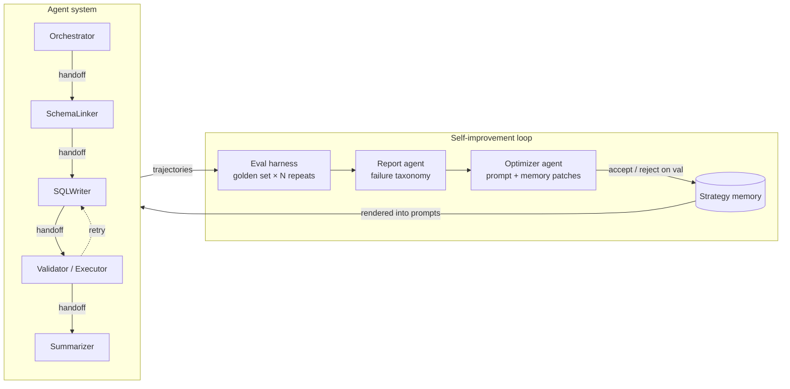
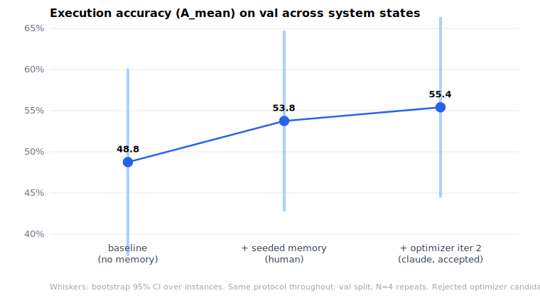

# ouroboros-sql

**A multi-agent Text-to-SQL system that evaluates itself and improves from its own failures.**

Built on the [OpenAI Agents SDK](https://openai.github.io/openai-agents-python/) (agents, function tools, handoffs, guardrails, sessions, tracing). The system answers analytics questions over SQLite databases through a pipeline of specialized agents — then a recursive loop evaluates full trajectories, aggregates failures into structured reports, and an optimizer agent rewrites the agents' strategy prompts and evolves a persistent strategy memory. The snake eats its tail.



## Why this exists

Three results from ICLR 2026 shape the design:

1. **Evaluate trajectories, with repeats.** ["LLMs Get Lost in Multi-Turn Conversation"](https://arxiv.org/abs/2505.06120) (Best Paper) showed top LLMs lose ~39% performance in multi-turn settings — and ~80% of that drop is *unreliability* (variance across runs), not aptitude. So this harness runs every golden example N times and reports an aptitude/unreliability decomposition (A_mean / A90 / U90), not just mean accuracy — and it scores tool calls and handoffs, not just final answers.
2. **Memory is a first-class, evolvable artifact.** [ALMA](https://arxiv.org/abs/2602.07755) meta-learns memory designs as executable code; [MemAgent](https://arxiv.org/abs/2507.02259) trains a fixed-size memory policy with RL. Here, a token-capped **strategy memory** (heuristics, exemplars, pitfalls — each with provenance to the failures that motivated it) is evolved by the optimizer and rendered into agent prompts.
3. **Eval first, then memory, then self-improvement.** You cannot close an improvement loop you cannot measure. The harness is the foundation; the optimizer is gated by it: patches are accepted only if they improve validation accuracy or reliability, and a held-out split is touched exactly once, for the final table.

Fine-tuning is out of scope by design — improvement happens in prompt-and-memory space ([Agent0](https://arxiv.org/abs/2511.16043)-style curriculum self-evolution is future work).

## Status

✅ **All four milestones complete** — agent system, trajectory eval harness, strategy memory, and the closed self-improvement loop, with final held-out results below. Every number is regenerable by one command and backed by committed run artifacts in [`docs/results/`](docs/results/) and [`iterations/`](iterations/).



## Baseline results (iteration 0)

`val` split · 63 examples (3 adversarial probes) × 4 repeats = 252 records · 0 harness errors

| Metric | Value [95% CI] |
|---|---|
| **Execution accuracy (A_mean)** | **48.8 [37.5, 60.0]** |
| Aptitude (A90) | 58.5 [45.8, 70.7] |
| Worst-case (A10) | 37.3 [26.2, 49.2] |
| **Unreliability (U90)** | **21.2 [12.7, 30.3]** |
| Judge score (mean) | 73.3 [67.7, 78.8] |
| Refusal accuracy (adversarial) | 83.3 [50.0, 100.0] |
| False-refusal rate | 0.0 |
| Schema-grounding precision / recall | 92.1 / 97.1 |
| Routing accuracy | 100.0 |
| Completion rate | 91.2 [86.2, 95.4] |
| Tokens per question (in+out) | 30.7k + 2.6k |
| Latency p50 / p95 | 54s / 123s |

Failure taxonomy (123 failing records): `wrong_result` 78 · `wrong_tables` 26 · `no_sql_executed` 19 · `guardrail_missed` 2

**What the decomposition says.** The headline 48.8% hides two different problems. The 21-point U90 means a large share of questions *sometimes* succeed and sometimes don't — same input, same system. Aptitude (A90 = 58.5%) is ~10 points above A_mean: making the system merely *consistent* at its own demonstrated best would be worth about ten points before making it any smarter. Process metrics are already strong (routing 100%, schema grounding 92/97, completion 91%) — the failures live in SQL semantics (`wrong_result`, `wrong_tables`), which is where the optimizer loop will aim.

**What didn't work (so far).** Judge–exec agreement is only 51% — the judge currently runs on the *same small model* as the agents (the only deployment on the eval endpoint), which violates the judge-should-be-stronger principle; treat process scores as weak signal until a frontier judge is wired in. Also, the harness's first smoke run caught two real bugs (runs silently ending on chatty non-handoff messages; false refusals from a database-blind guardrail) — fixed before this baseline, and the fix is visible in `git log`.

<sub>Run `baseline-val-v0`, 2026-07-21. Agent+judge model: `gpt-5-mini`, N=4 repeats, golden-set seed 20260721, bootstrap CIs over instances (2000 draws). Reproduce: `uv run ouroboros eval --split val --repeats 4 --judge`. The holdout split remains untouched until the final M4 evaluation. Not comparable to BIRD leaderboard numbers: this evaluates a filtered 60-question slice of mini-dev (not the official 1,534-question dev set), reports the mean over 4 repeated runs instead of the official single-attempt protocol, and uses its own result-normalization rules rather than BIRD's official evaluation script.</sub>

## Ablation: seeded strategy memory (M3)

Nine hand-written memory entries derived from the baseline failure analysis ([`scripts/seed_memory.py`](scripts/seed_memory.py) — each entry cites the failure class it targets), same protocol as baseline (val, N=4, judge):

| | memory off (baseline) | memory on (9 seeded entries) |
|---|---|---|
| Execution accuracy (A_mean) | 48.8 [37.5, 60.0] | **53.8 [42.9, 64.6]** |
| Aptitude (A90) | 58.5 | 63.5 |
| Unreliability (U90) | 21.2 | 23.2 |
| `wrong_result` failures | 78 | **60** |
| `no_sql_executed` failures | 19 | 25 |
| Tokens per question (in) | 30.7k | 41.3k |
| Latency p50 | 54s | 75s |

**Paired comparison** (same 60 instances, bootstrap over per-instance deltas): **+5.0 points, 95% CI [+0.4, +10.0]** — 15 instances improved, 6 regressed, 39 unchanged. The seeded heuristics did what they were written for: `wrong_result`, the class 6 of 9 entries target, dropped 23%. Honest trade-offs: prompts grew, so cost rose ~35% and latency ~40%; `no_sql_executed` ticked up (longer prompts appear to increase mid-pipeline stalls); U90 did not improve — consistency, the biggest single opportunity from the baseline, is untouched by static memory. That is the M4 optimizer's job.

<sub>Run `ablation-val-memory-v1`, 2026-07-21, artifacts in [`docs/results/`](docs/results/). Reproduce: `uv run python scripts/seed_memory.py && uv run ouroboros eval --split val --repeats 4 --judge` (and `--no-memory` for the baseline arm).</sub>

## Quickstart

```bash
git clone https://github.com/Yanan-Gong/ouroboros-sql && cd ouroboros-sql
uv sync --extra dev
cp .env.example .env   # add your OPENAI_API_KEY

uv run ouroboros download-data          # BIRD mini-dev SQLite databases (~500MB, checksummed)
uv run ouroboros query "Which schools in Alameda County have the highest eligible free meal rate?" --db california_schools
```

Multi-turn follow-ups work in the same session:

```bash
uv run ouroboros query --interactive --db california_schools
```

## Architecture

| Component | Role |
|---|---|
| **Orchestrator** | Triage: routes analytics questions into the pipeline, refuses off-topic requests |
| **SchemaLinker** | Explores the database via tools (`list_tables`, `describe_table`, `sample_rows`) and selects relevant tables/columns |
| **SQLWriter** | Drafts the SQL query from the linked schema |
| **Validator/Executor** | Executes on SQLite, catches errors, drives the retry loop |
| **Summarizer** | Turns executed results into a faithful natural-language answer |

**Safety is code, not prompt.** Databases are opened read-only (`file:...?mode=ro`) *and* every statement must parse via sqlglot as a single SELECT — DDL/DML/PRAGMA/ATTACH are rejected in the tool implementation before touching the database. Guardrail prompts are defense-in-depth on top.

**Trajectories are data.** Every run serializes the full Agents SDK item stream — tool calls, handoffs, retries, token usage — into typed records the eval harness consumes. The SDK's built-in tracing stays on for debugging.

## Evaluation methodology (M2)

- **Golden set** from [BIRD mini-dev](https://github.com/bird-bench/mini_dev) (SQLite), split train/val/holdout; ~10% adversarial probes (off-topic questions, injection attempts) to measure guardrails.
- **Execution accuracy** (deterministic): normalized result-set match between predicted and gold SQL.
- **Reliability decomposition** (per 2505.06120): each example runs N times → A_mean, A90 (aptitude), U90 (unreliability), with bootstrap CIs.
- **Tool-usage metrics**: schema-grounding precision/recall vs. tables in gold SQL, wasted-call rate, retry productivity.
- **Handoff metrics**: routing accuracy, ping-pong count, completion rate.
- **LLM-as-judge** trajectory rubric, anchored: the judge never overturns execution match, and judge–exec agreement is reported.
- **Cost & latency** in every table.

## The self-improvement loop (M4) — what actually happened

Eval on train → deterministic failure taxonomy → analyst agent → optimizer proposes bounded patches (strategy/exemplar prompt sections only; memory ops with provenance) → re-eval on val → **accept only if accuracy or reliability improves** (pre-registered gate: A_mean +≥1pt, or U90 −≥2pts at A_mean ≥−0.5pt; safety brake on false-refusal spikes) → rollback on reject. Topology, tools, guardrails, and the judge are never mutated — optimizing the judge is reward hacking.

**Results.** With a small model as optimizer: 2 iterations, 0 accepted — every patch regressed val and the gate rolled each back. With a frontier optimizer (Claude Opus 4.8) on the same failure reports and the same bounds: **3 iterations, 1 accepted — val A_mean 53.8 → 55.4 (+1.7)** at unchanged U90, targeting phrase-to-column mapping and multi-valued TEXT membership in the SQLWriter plus SQL-only handoffs in the SchemaLinker. Its other two proposals were rejected on merit (−1.7 and −5.0 A_mean) and rolled back. Every iteration's patchset, unified diffs, val metrics, and decision are committed under [`iterations/`](iterations/).

**Final held-out result** (untouched split, evaluated once at the end, both arms pre-declared):

| | iteration-0 (no memory) | final state (memory + accepted patch) |
|---|---|---|
| Execution accuracy (A_mean) | 39.2 [27.9, 50.8] | 42.5 [30.8, 53.8] |
| Aptitude (A90) | 43.3 | 49.0 |
| Unreliability (U90) | 10.3 | 13.7 |

Paired over the same 60 instances: **+3.3 points, 95% CI [−1.7, +8.8]** — 9 instances improved, 4 regressed. Directionally consistent with the val gains, but the interval includes zero: at this sample size the held-out improvement is *suggestive, not confirmed*. We report it that way on purpose. (The holdout split is also visibly harder than val — 39.2 vs 48.8 at iteration 0 — a reminder of how much 60-example splits vary.)

**What building the loop taught us** (all visible in `git log`):

- *A cage without feedback just stops the learner.* Three early runs stalled because the small optimizer model could not count characters against prompt budgets (1971 and 1532 chars vs a 1200 cap, even with the error fed back). The fix wasn't better prompting — it was mechanical: advertise headroom, retry with the exact violation, and finally clamp oversized patches at whole-line granularity with every clamp logged. Formatting can no longer forfeit an iteration; the val gate stays the only judge of quality.
- *Cache keys must encode state.* The harness resumes evals from cached records by run id; date-based loop ids let a relaunched gate silently "evaluate" a new patchset using a previous attempt's records — byte-identical metrics were the tell. Loop run ids now embed a hash of the mutable state (prompts + memory), so a cache hit is only possible for an identical system.
- *The gate is the product.* Across both optimizer models, 5 of 6 proposed patchsets would have made the system worse. The loop's chief value this round was not the +1.7 it found — it was the −10+ points of regressions it refused, automatically, with byte-exact rollback.

## Limitations & future work

- **Judge = worker model** (only deployment on the eval endpoint): 51% judge–exec agreement makes process scores weak signal. A frontier judge is the first upgrade.
- **60-example splits** give ±11-point CIs; the val-confirmed gains (+5.0 memory, +1.7 optimizer, both paired-significant on val) need a larger holdout to confirm out-of-sample.
- **U90 remains untouched** (21 points on val): static prompt/memory edits bought accuracy, not consistency. Candidate attacks: self-consistency voting in the Validator, or "consolidate-and-retry" per Lost-in-Multi-Turn's own advice.
- **Agent0-style curriculum** ([arXiv:2511.16043](https://arxiv.org/abs/2511.16043)): let a curriculum agent generate targeted hard cases at the executor's frontier instead of resampling a fixed train split.

## Development

```bash
uv run pytest          # offline — no API key needed (FakeModel + replay fixtures)
uv run ruff check .
uv run mypy
docker build -t ouroboros-sql .
```

## Data & licensing

Code is MIT. Benchmark questions/SQL derive from BIRD (CC BY-SA 4.0) — see `data/golden/LICENSE`. Databases are downloaded at setup, never committed.
