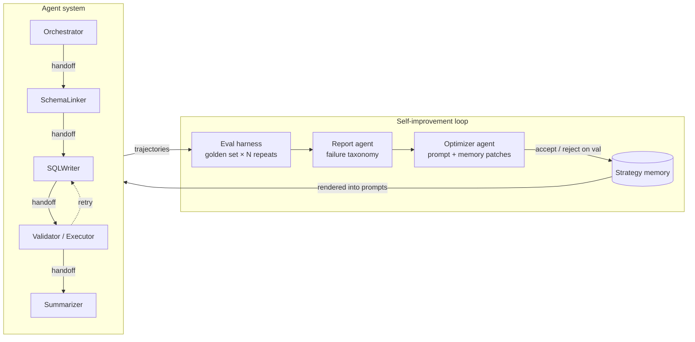

# ouroboros-sql

**A multi-agent Text-to-SQL system that evaluates itself and improves from its own failures.**

Built on the [OpenAI Agents SDK](https://openai.github.io/openai-agents-python/) (agents, function tools, handoffs, guardrails, sessions, tracing). The system answers analytics questions over SQLite databases through a pipeline of specialized agents — then a recursive loop evaluates full trajectories, aggregates failures into structured reports, and an optimizer agent rewrites the agents' strategy prompts and evolves a persistent strategy memory. The snake eats its tail.



## Why this exists

Three results from ICLR 2026 shape the design:

1. **Evaluate trajectories, with repeats.** ["LLMs Get Lost in Multi-Turn Conversation"](https://arxiv.org/abs/2505.06120) (Best Paper) showed top LLMs lose ~39% performance in multi-turn settings — and ~80% of that drop is *unreliability* (variance across runs), not aptitude. So this harness runs every golden example N times and reports an aptitude/unreliability decomposition (A_mean / A90 / U90), not just mean accuracy — and it scores tool calls and handoffs, not just final answers.
2. **Memory is a first-class, evolvable artifact.** [ALMA](https://arxiv.org/abs/2602.07755) meta-learns memory designs as executable code; [MemAgent](https://arxiv.org/abs/2507.02259) trains a fixed-size memory policy with RL. Here, a token-capped **strategy memory** (heuristics, exemplars, pitfalls — each with provenance to the failures that motivated it) is evolved by the optimizer and rendered into agent prompts.
3. **Eval first, then memory, then self-improvement.** You cannot close an improvement loop you cannot measure. The harness is the foundation; the optimizer is gated by it: patches are accepted only if they improve validation accuracy or reliability, and a held-out split is touched exactly once, for the final table.

Fine-tuning is out of scope by design — improvement happens in prompt-and-memory space ([Agent0](https://arxiv.org/abs/2511.16043)-style curriculum self-evolution is future work).

## Status

🚧 **Milestone 1 of 4** — agent system, guardrails, data pipeline, offline test suite. The eval harness (M2), strategy memory (M3), and optimizer loop (M4) land next; every results number that appears here will be regenerable by one command and backed by committed run artifacts. **No results are reported yet.**

## Quickstart

```bash
git clone https://github.com/Yanan-Gong/ouroboros-sql && cd ouroboros-sql
uv sync --extra dev
cp .env.example .env   # add your OPENAI_API_KEY

uv run ouroboros download-data          # BIRD mini-dev SQLite databases (~500MB, checksummed)
uv run ouroboros query "Which schools in Alameda County have the highest eligible free meal rate?" --db california_schools
```

Multi-turn follow-ups work in the same session:

```bash
uv run ouroboros query --interactive --db california_schools
```

## Architecture

| Component | Role |
|---|---|
| **Orchestrator** | Triage: routes analytics questions into the pipeline, refuses off-topic requests |
| **SchemaLinker** | Explores the database via tools (`list_tables`, `describe_table`, `sample_rows`) and selects relevant tables/columns |
| **SQLWriter** | Drafts the SQL query from the linked schema |
| **Validator/Executor** | Executes on SQLite, catches errors, drives the retry loop |
| **Summarizer** | Turns executed results into a faithful natural-language answer |

**Safety is code, not prompt.** Databases are opened read-only (`file:...?mode=ro`) *and* every statement must parse via sqlglot as a single SELECT — DDL/DML/PRAGMA/ATTACH are rejected in the tool implementation before touching the database. Guardrail prompts are defense-in-depth on top.

**Trajectories are data.** Every run serializes the full Agents SDK item stream — tool calls, handoffs, retries, token usage — into typed records the eval harness consumes. The SDK's built-in tracing stays on for debugging.

## Evaluation methodology (M2)

- **Golden set** from [BIRD mini-dev](https://github.com/bird-bench/mini_dev) (SQLite), split train/val/holdout; ~10% adversarial probes (off-topic questions, injection attempts) to measure guardrails.
- **Execution accuracy** (deterministic): normalized result-set match between predicted and gold SQL.
- **Reliability decomposition** (per 2505.06120): each example runs N times → A_mean, A90 (aptitude), U90 (unreliability), with bootstrap CIs.
- **Tool-usage metrics**: schema-grounding precision/recall vs. tables in gold SQL, wasted-call rate, retry productivity.
- **Handoff metrics**: routing accuracy, ping-pong count, completion rate.
- **LLM-as-judge** trajectory rubric, anchored: the judge never overturns execution match, and judge–exec agreement is reported.
- **Cost & latency** in every table.

## The self-improvement loop (M4)

Eval on train → deterministic failure taxonomy → report agent → optimizer proposes bounded patches (strategy/exemplar prompt sections only; memory upserts with provenance) → re-eval on val → **accept only if accuracy or reliability improves** → repeat until convergence or budget. Topology, tools, guardrails, and the judge are never mutated — optimizing the judge is reward hacking.

## Development

```bash
uv run pytest          # offline — no API key needed (FakeModel + replay fixtures)
uv run ruff check .
uv run mypy
docker build -t ouroboros-sql .
```

## Data & licensing

Code is MIT. Benchmark questions/SQL derive from BIRD (CC BY-SA 4.0) — see `data/golden/LICENSE`. Databases are downloaded at setup, never committed.
